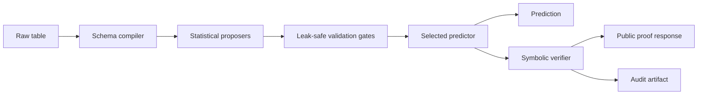

# TabPVN

**Proof-carrying tabular prediction without pretrained weights.**

> [!IMPORTANT]
> TabPVN is source-available for research and evaluation only. Production use,
> commercial use, and operational decision-making require separate written
> permission. This is not an open-source license. See [LICENSE](LICENSE).

**Start with the differentiator:** [inspect a proof-carrying reply](#proof-carrying-reply).

TabPVN is a deterministic, self-configuring estimator for tabular classification
and regression. It combines statistical proposers with a symbolic verifier so a
prediction can be returned with a machine-checkable account of how the fitted
model produced it.

The research question is simple: how far can tabular prediction be pushed with
explicit programs, leak-safe validation, and verifiable arithmetic instead of a
pretrained black-box prior?

TabPVN uses no hosted model, pretrained checkpoint, or training-time neural
network. The default `fit` path automatically handles numeric and categorical
columns, missing values, text-like fields, imbalanced targets, and repeated
entity-event tables. Candidate components are deployed only when bounded
out-of-fold or future-window evidence admits them.

> TabPVN proofs verify model execution and declared statistical evidence. They do
> not guarantee that an unknown individual label or target is correct.

## Research Contribution

TabPVN introduces a **Proposer-Verifier Network (PVN)** for tabular learning. A
PVN treats model construction as validated program synthesis rather than a
single opaque optimization step:

1. **Proposers generate explicit candidate programs.** Candidates include
   additive threshold regions, categorical posteriors, numeric intervals,
   affine reads, compression evidence, and causal temporal state.
2. **A verifier assigns bounded authority.** Each candidate is measured on
   training-only out-of-fold predictions, or on past-to-future windows for event
   data. It may receive ranking authority, decision authority, both, or neither.
3. **The selected program carries its execution proof.** Prediction conditions
   and arithmetic can be replayed independently by the small symbolic kernel.
4. **The default is the research method.** Architecture selection, imbalance
   handling, calibration, and scale budgets are automatic; dataset-specific
   tuning is not required.

This separates two questions that conventional estimators usually combine:
*what structure might predict well?* and *what evidence permits that structure
to affect a result?* The proposer can be aggressive; the verifier remains the
deployment boundary.

| Property | TabPVN research path | Conventional fitted predictor |
| --- | --- | --- |
| Candidate search | Multiple explicit, bounded program families | One configured model family |
| Admission | Out-of-fold or future-window transfer evidence | Training objective and configured regularization |
| Authority | Separate ranking and decision permissions | Predictor output is authoritative by default |
| Prediction evidence | Replayable conditions, arithmetic, and audit binding | Model-specific inspection or post-hoc explanation |
| User configuration | Automatic defaults with advanced overrides | Commonly selected through tuning |

## Proof-Carrying Reply

A normal regressor returns a number. TabPVN returns the number together with a
validated error bound, replayable conditions, and a machine-checkable audit
binding.

This example uses the real
[UCI/NASA Airfoil Self-Noise dataset](https://archive.ics.uci.edu/dataset/291/airfoil%2Bself%2Bnoise),
whose target is scaled sound pressure in decibels. It uses official TabArena
fold 0 and the automatic `TabPVN()` defaults, with no dataset-specific tuning.

| Official fold-0 result | Value |
| --- | ---: |
| Training / held-out rows | 1,002 / 501 |
| TabPVN RMSE | **1.2879 dB** |
| Histogram GBDT RMSE | 1.5462 dB |
| Relative RMSE reduction | **16.7%** |

The following held-out row was selected for a compact proof with readable
physical conditions. It is an illustrative response, not the aggregate result
above. Reproducing it requires the `openml` optional dependency:

```python
from benchmark.datasets import tabarena_suite
from tabpvn import TabPVN

dataset = tabarena_suite(dataset_names=["airfoil_self_noise"])[0]
train_indices, test_indices = dataset.splits[0]

model = TabPVN(task="regression").fit(
    dataset.X.iloc[train_indices],
    dataset.y[train_indices],
)
held_out_row = 355
row = dataset.X.iloc[[test_indices[held_out_row]]]
```

Input:

```json
{
  "frequency": 4000,
  "attack-angle": "15.4",
  "chord-length": 0.0508,
  "free-stream-velocity": 55.5,
  "suction-side-displacement-thickness": 0.0271925
}
```

The public reply predicts **119.943 dB** and returns a validated interval of
**[117.634, 122.252] dB**. Its first replayable reason requires all of these
observed conditions:

| Feature | Verified condition | Observed |
| --- | ---: | ---: |
| Frequency | `2500 < x <= 5000` | 4000 Hz |
| Displacement thickness | `x > 0.00592927` | 0.0271925 m |
| Chord length | `x > 0.0254` | 0.0508 m |
| Free-stream velocity | `x > 39.6` | 55.5 m/s |

The target was not supplied when the reply was built. Afterward, the held-out
target was revealed as **120.920 dB**, an absolute error of **0.977 dB**, inside
the declared interval.

<details>
<summary>Complete public <code>tabpvn.proof/3</code> response</summary>

```json
{
  "schema": "tabpvn.proof/3",
  "summary": "Prediction: 119.943. Decision verification passed. Validated error bound: +/- 2.30923. No observed target was supplied.",
  "prediction": {
    "task": "regression",
    "value": 119.94294784614738
  },
  "reliability": {
    "status": "verified",
    "type": "error_bound",
    "value": 2.3092268354244765,
    "applies_to": "validated_population",
    "interval": [
      117.6337210107229,
      122.25217468157186
    ]
  },
  "reasons": [
    {
      "conditions": [
        {
          "feature": "frequency",
          "operator": "gt",
          "value": 2500.0,
          "observed": 4000.0
        },
        {
          "feature": "frequency",
          "operator": "lte",
          "value": 5000.0,
          "observed": 4000.0
        },
        {
          "feature": "suction-side-displacement-thickness",
          "operator": "gt",
          "value": 0.00592927,
          "observed": 0.0271925
        },
        {
          "feature": "chord-length",
          "operator": "gt",
          "value": 0.0254,
          "observed": 0.0508
        },
        {
          "feature": "free-stream-velocity",
          "operator": "gt",
          "value": 39.6,
          "observed": 55.5
        }
      ],
      "supports": 119.94294784614738
    },
    {
      "conditions": [
        {
          "feature": "frequency",
          "operator": "gt",
          "value": 3150.0,
          "observed": 4000.0
        },
        {
          "feature": "frequency",
          "operator": "lte",
          "value": 5000.0,
          "observed": 4000.0
        },
        {
          "feature": "suction-side-displacement-thickness",
          "operator": "gt",
          "value": 0.00544854,
          "observed": 0.0271925
        },
        {
          "feature": "chord-length",
          "operator": "gt",
          "value": 0.0254,
          "observed": 0.0508
        }
      ],
      "supports": 119.94294784614738
    },
    {
      "conditions": [
        {
          "feature": "frequency",
          "operator": "gt",
          "value": 2500.0,
          "observed": 4000.0
        },
        {
          "feature": "frequency",
          "operator": "lte",
          "value": 5000.0,
          "observed": 4000.0
        },
        {
          "feature": "suction-side-displacement-thickness",
          "operator": "gt",
          "value": 0.00461377,
          "observed": 0.0271925
        },
        {
          "feature": "chord-length",
          "operator": "lte",
          "value": 0.0508,
          "observed": 0.0508
        }
      ],
      "supports": 119.94294784614738
    },
    {
      "conditions": [
        {
          "feature": "frequency",
          "operator": "gt",
          "value": 3150.0,
          "observed": 4000.0
        },
        {
          "feature": "frequency",
          "operator": "lte",
          "value": 8000.0,
          "observed": 4000.0
        },
        {
          "feature": "suction-side-displacement-thickness",
          "operator": "gt",
          "value": 0.00251435,
          "observed": 0.0271925
        },
        {
          "feature": "chord-length",
          "operator": "gt",
          "value": 0.0254,
          "observed": 0.0508
        }
      ],
      "supports": 119.94294784614738
    },
    {
      "conditions": [
        {
          "feature": "frequency",
          "operator": "gt",
          "value": 2500.0,
          "observed": 4000.0
        },
        {
          "feature": "frequency",
          "operator": "lte",
          "value": 4000.0,
          "observed": 4000.0
        },
        {
          "feature": "suction-side-displacement-thickness",
          "operator": "gt",
          "value": 0.00566229,
          "observed": 0.0271925
        },
        {
          "feature": "chord-length",
          "operator": "gt",
          "value": 0.0254,
          "observed": 0.0508
        }
      ],
      "supports": 119.94294784614738
    }
  ],
  "outcome": {
    "status": "not_observed"
  },
  "verification": {
    "status": "verified",
    "decision": "verified",
    "reliability": "verified",
    "audit_reference": "sha256:8daf0cf6862e03c4e62d329cf248d38353c01e8a81773de0ed5255084429c293"
  }
}
```

</details>

This is model execution evidence, not post-hoc feature importance. The audit
reference binds the unmodified public reply to its detailed artifact. The
artifact verifies without fitted model state, and changing the prediction makes
verification fail:

```python
from copy import deepcopy

from tabpvn import TabPVN

reply = model.proof(row, row=0)
artifact = model.proof_artifact(row, row=0)

assert TabPVN.check_proof(artifact)
assert TabPVN.check_proof(reply, artifact=artifact)

tampered = deepcopy(reply)
tampered["prediction"]["value"] = 0.0
assert not TabPVN.check_proof(tampered, artifact=artifact)

lower, upper = reply["reliability"]["interval"]
observed_target = dataset.y[test_indices[held_out_row]]
assert lower <= observed_target <= upper
```

The distinction is deliberate: verification proves that the disclosed reasons
and arithmetic reproduce the model response and its fitted reliability claim.
It does not claim access to the unknown ground-truth outcome.

## Measured Performance

These results are research snapshots, not a claim that TabPVN is state of the
art. They report fixed protocols and include the negative primary-comparator
result.

### TabArena versus histogram GBDT

The last completed packaged-default promotion run used official TabArena v0.1
fold 0 for all 51 tasks. Classification was scored by ROC AUC (macro one-vs-one
for multiclass); regression was scored by RMSE. Each model used the same task
split, and a win means higher AUC or lower RMSE.

| Fold-0 result | TabPVN | Histogram GBDT |
| --- | ---: | ---: |
| Average rank across 51 tasks | **1.235** | 1.765 |
| Task wins | **39 / 51** | 12 / 51 |
| Classification wins | **26 / 38** | 12 / 38 |
| Regression wins | **13 / 13** | 0 / 13 |

Across the 38 classification tasks, the mean paired difference was **+0.0079
ROC AUC** with a 95% normal-approximation interval of **[+0.0038, +0.0121]**.
Across the 13 regression tasks, the mean paired reduction in RMSE was **5.45%**,
with a 95% normal-approximation interval of **[2.66%, 8.25%]**.

This is a one-fold architecture-promotion result. It is useful evidence against
the fixed GBDT baseline, but it is not enough for a general superiority claim.

### Primary comparison: TabPFN-3

A bounded CPU check covered four official fold-0 classification tasks. TabPVN
did not beat TabPFN-3 on this slice:

| Dataset | TabPVN ROC AUC | TabPFN-3 ROC AUC |
| --- | ---: | ---: |
| `maternal_health_risk` | 0.9464 | **0.9652** |
| `credit-g` | 0.7619 | **0.7824** |
| `qsar-biodeg` | 0.9229 | **0.9318** |
| `taiwanese_bankruptcy_prediction` | 0.9358 | **0.9509** |

The current evidence therefore supports "competitive with a strong fixed GBDT
baseline on this protocol," not "better than TabPFN-3" or "best in the world."
TabPFN-3 remains the primary research target.

### Million-row scale check

The completed Kaggle HIGGS scale audit used 1,000,000 training rows, 50,000 test
rows, and 28 numeric features. On an Apple M1 Pro with 16 GB RAM, the default
TabPVN path recorded:

| Metric | Result |
| --- | ---: |
| ROC AUC | 0.8284 |
| Accuracy | 0.7474 |
| Log loss | 0.5064 |
| Fit time | 101.4 s |
| Probability inference, 50K rows | 1.52 s |
| Peak resident memory | 0.84 GiB |

This run demonstrates bounded million-row execution; it did not include a
same-run competitor and therefore is not an accuracy comparison. The wider
BeyondArena 1M+ audit also exposed unresolved memory and timeout limits on wide
tables, which remain active research work.

Results were produced on macOS with Python 3.11, NumPy 2.4, and scikit-learn
1.6. The Arena summary corresponds to implementation fingerprint
`43b88eec9ae1d545`; the HIGGS snapshot was recorded on 2026-07-16. Regenerate
results after implementation or dependency changes before making comparative
claims.

## Core Idea



1. **Compile the table.** Raw pandas and NumPy inputs become deterministic numeric,
   categorical, missingness, text, relation, or temporal facts.
2. **Propose bounded improvements.** The certified additive booster can be
   complemented by explicit categorical posteriors, numeric interval evidence,
   affine reads, compression evidence, or causal temporal state.
3. **Require transferable evidence.** A challenger receives decision or ranking
   authority only after passing the relevant held-out protocol.
4. **Verify the result.** The proof kernel independently replays the selected
   rules and arithmetic.
5. **Separate public and audit surfaces.** `proof()` returns a stable,
   implementation-neutral response. `proof_artifact()` returns detailed material
   only when an auditor explicitly requests it.

## Capabilities

| Area | Current behavior |
| --- | --- |
| Classification | Binary and multiclass prediction with calibrated probabilities |
| Regression | Point prediction with conformal error bounds when calibration is available |
| Raw schemas | pandas and NumPy inputs, categoricals, missing values, datetime, and bounded text evidence |
| Imbalance | Rare-event sampling, average-precision gates, and explicit operating points |
| Event tables | Automatic entity/time discovery with causal future-window validation |
| Explanations | Typed conditions, sufficient reasons, stability, recourse, and proof artifacts |
| Decisions | Prior-shift correction, cost-derived abstention, and no-arbitrage checks |
| Persistence | Atomic, versioned model save and load |
| Integration | sklearn-style `fit`, `predict`, `predict_proba`, `score`, and parameter methods |

## Installation

TabPVN currently supports Python 3.11 and 3.12.

```bash
git clone git@github.com:lenileiro/TabPVN.git
cd TabPVN
uv sync
```

For an editable installation without `uv`:

```bash
python -m pip install -e .
```

Optional dependency groups are installed only when needed:

```bash
uv sync --extra dev        # pytest, Ruff, mypy, and vulture
uv sync --extra openml     # OpenML and TabArena datasets
uv sync --extra gbdt       # XGBoost, LightGBM, and CatBoost baselines
uv sync --extra pfn        # TabPFN comparison backend
uv sync --extra benchmark  # large-data benchmark dependencies
uv sync --extra attest     # signed target attestations
```

## Classification Example

The public surface follows the familiar sklearn lifecycle. No architecture or
dataset-specific parameters are required.

```python
from sklearn.datasets import load_breast_cancer
from sklearn.model_selection import train_test_split

from tabpvn import TabPVN

dataset = load_breast_cancer(as_frame=True)
X_train, X_test, y_train, y_test = train_test_split(
    dataset.data,
    dataset.target,
    test_size=0.25,
    random_state=0,
    stratify=dataset.target,
)

model = TabPVN().fit(X_train, y_train)

labels = model.predict(X_test)
probabilities = model.predict_proba(X_test)
accuracy = model.score(X_test, y_test)

print(labels[:5])
print(probabilities[:2])
print(f"accuracy={accuracy:.3f}")
```

### Proof for one prediction

```python
row = X_test.iloc[[0]]

# Stable response intended for applications and API clients.
proof = model.proof(row, row=0)

# Detailed derivation intended for auditors and verification services.
artifact = model.proof_artifact(row, row=0)

# Verification needs no fitted model state.
assert TabPVN.check_proof(artifact)
assert TabPVN.check_proof(proof, artifact=artifact)

print(proof["prediction"])
print(proof["reliability"])
print(proof["reasons"])
print(proof["verification"]["audit_reference"])
```

The public response uses typed, programmatic conditions such as:

```json
{
  "feature": "mean radius",
  "operator": "lte",
  "value": 15.2,
  "observed": 13.4
}
```

It does not expose tree indexes, logits, internal candidate names, or fitting
stages. The separate artifact contains the arithmetic needed for independent
verification and is cryptographically bound to the public response by its audit
reference.

## Regression Example

```python
import numpy as np
from sklearn.datasets import load_diabetes
from sklearn.model_selection import train_test_split

from tabpvn import TabPVN

dataset = load_diabetes(as_frame=True)
X_train, X_test, y_train, y_test = train_test_split(
    dataset.data,
    dataset.target,
    test_size=0.25,
    random_state=0,
)

model = TabPVN(task="regression").fit(X_train, y_train)
rows = X_test.iloc[:5]

prediction = model.predict(rows)
error_bound = model.confidence(rows)

print(prediction)
if error_bound is not None:
    intervals = np.column_stack((prediction - error_bound, prediction + error_bound))
    print(intervals)

proof = model.proof(rows, row=0)
artifact = model.proof_artifact(rows, row=0)
assert TabPVN.check_proof(proof, artifact=artifact)
```

## Event-Table Example

Repeated entity-event tables use the same `fit` method. TabPVN inspects plausible
entity and timestamp roles without labels, evaluates bounded causal representations
on later windows, and keeps the event path only when it improves the ordinary raw
schema.

```python
import numpy as np
import pandas as pd

from tabpvn import TabPVN

event_index = np.arange(60)
amount = np.where(event_index % 5 == 0, 200.0 + event_index, 5.0 + event_index % 10)
train_events = pd.DataFrame(
    {
        "account_id": np.tile(["a", "b", "c"], 20),
        "event_time": pd.date_range("2026-01-01 09:00", periods=60, freq="min"),
        "amount": amount,
        "country": np.where(event_index % 5 == 0, "US", "EE"),
    }
)
labels = (amount > 100.0).astype(int)

model = TabPVN(task="classification").fit(train_events, labels)

future_events = pd.DataFrame(
    {
        "account_id": ["a", "b"],
        "event_time": pd.to_datetime(["2026-01-01 10:12", "2026-01-01 10:13"]),
        "amount": [210.0, 7.0],
        "country": ["US", "EE"],
    }
)

prediction = model.predict(future_events)
print(model.event_schema_)  # None when the causal challenger was not admitted.
print(prediction)
```

For unusual column names, `entity=`, `timestamp=`, and `value_columns=` are
available as advanced schema overrides. They are not normal tuning parameters.
Prediction calls never silently mutate the fitted history; separate calls remain
deterministic and concurrency-safe.

## Persistence

```python
model.save("fraud-model.tabpvn")

loaded = TabPVN.load("fraud-model.tabpvn")
prediction = loaded.predict(future_events)
```

Only load artifacts from trusted sources. Model loading reconstructs Python
objects and is not a safe boundary for untrusted files.

## Research Program

TabPVN is built around five constraints:

1. **No pretrained tabular model.** Runtime behavior must be implemented in this
   repository and inspectable.
2. **No required user tuning.** The default estimator chooses bounded candidate
   schedules and permissions from training-only evidence.
3. **No validation leakage.** Ordinary tables use out-of-fold evidence; event
   tables use past-to-future validation with equal timestamps kept together.
4. **No hidden class-changing component.** Any component allowed to change a
   label must carry explicit replayable evidence.
5. **No universal claim from one benchmark.** Accuracy, ranking, calibration,
   memory, and latency must be reported under the exact task protocol.

The primary research comparison is TabPFN-3. Fixed GBDT implementations remain
important secondary baselines because they are strong, fast, and widely deployed.
The goal is not to optimize one leaderboard slice; it is to find explicit
architectural components that transfer across binary, multiclass, regression,
categorical, rare-event, temporal, and large-row tasks.

### Evaluation rules

- Use official OpenML task folds for TabArena comparisons.
- Use ROC AUC for ordinary binary ranking and macro one-vs-one AUC for multiclass.
- Use average precision for rare-event ranking; raw accuracy can hide a model that
  never finds the minority class.
- Use RMSE or negative RMSE for regression comparisons.
- Report fit time, prediction time, peak memory, package versions, hardware, and
  the exact Git commit.
- Treat one-fold runs as smoke tests. Promotion claims require repeated or official
  folds and paired task-level comparisons.
- Keep full Arena and TabPFN-3 runs out of the normal edit loop because they are
  expensive and slow.

## Reproducing Benchmarks

Fast, network-free harness check:

```bash
uv run python -m benchmark.experiments.run \
  --suite sklearn \
  --models tabpvn,hgb \
  --splits 3 \
  --out results/sklearn-smoke.csv
```

One bounded TabArena fold with OpenML data:

```bash
uv run --extra openml python -m benchmark.experiments.run \
  --suite tabarena \
  --ta-size 10k-100k \
  --models tabpvn,hgb \
  --splits 1 \
  --reference hgb \
  --out results/tabarena-smoke.csv
```

Primary comparison against TabPFN:

```bash
uv run --extra openml --extra pfn python -m benchmark.experiments.run \
  --suite tabarena \
  --ta-size le10k \
  --models tabpvn,tabpfn \
  --splits 1 \
  --reference tabpfn \
  --out results/tabpfn-comparison.csv
```

For rare binary tasks, add:

```text
--classification-metric average_precision
```

Omit `--splits` only when intentionally running every official task fold. Generated
datasets and result files are ignored by Git so benchmark artifacts cannot enter a
source commit accidentally.

## Repository Layout

```text
core/                 trusted first-order-logic verification kernel
tabpvn/               estimator, proposers, proofs, persistence, and tests
tabpvn/proposers/     bounded candidate components and their verifiers
benchmark/            datasets, baselines, protocol runner, and focused audits
scripts/              package release checks
tools/                release-artifact verification
pyproject.toml        package metadata and quality configuration
uv.lock               reproducible dependency resolution
```

The runtime wheel contains only `core` and `tabpvn`. Benchmark code, tests,
downloaded data, result files, and archived experiments are excluded from release
artifacts.

## Development

Fast commit-level checks:

```bash
uv run --locked --extra dev ruff check tabpvn core benchmark
uv run --locked --extra dev ruff format --check tabpvn core benchmark
uv run --locked --extra dev mypy
uv run --locked --extra dev pytest -q \
  tabpvn/tests/test_production_contract.py \
  tabpvn/tests/test_proof_response.py \
  tabpvn/tests/test_api.py
```

Complete package release gate:

```bash
./scripts/release_check.sh
```

The release gate runs the full TabPVN test suite and package build. Arena,
million-row, and TabPFN-3 evaluations are separate research gates.

## Status and Limitations

TabPVN is research software and the public API is pre-1.0.

- Proof verification establishes that the supplied facts, rules, and arithmetic
  reproduce the declared model output. It does not observe unknown ground truth.
- Statistical guarantees depend on their calibration and exchangeability or
  temporal assumptions.
- Held-out promotion reduces the chance of harmful components but cannot guarantee
  improvement under arbitrary distribution shift.
- Automatic cross-fitting can make `fit` more expensive than a single conventional
  tree fit.
- Full benchmark conclusions must be regenerated from the pinned commit and
  protocol; result CSVs are not treated as source code.

## Citation

Until a formal paper is published, cite the repository and pin the commit used in
the experiment:

```bibtex
@software{leiro2026tabpvn,
  author = {Anthony Leiro},
  title = {TabPVN: Proof-Carrying Tabular Prediction},
  year = {2026},
  url = {https://github.com/lenileiro/TabPVN}
}
```

## License

TabPVN is distributed under the custom
[TabPVN Research-Only Source License 1.0](LICENSE). It permits use,
modification, reproducibility work, benchmarking, and redistribution under the
same terms solely for research and evaluation. Commercial use, production use,
commercial product development, fee-based services, and operational decisions
require a separate written license.

This is a source-available license, not an OSI-approved open-source license.
